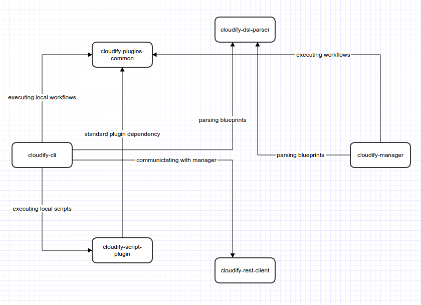

Cloudify Development Environment
================================


# Welcome, developer!

We are glad you decided to join our community! <br>

This will guide you through the steps needed to setup and maintain a cloudify development environment.

We will go through:

* Requirements.
* Basic breakdown of cloudify's main repositories.
* Issues Management.
* Continuous Integration.
* Version control.
* Tests.
* Code Style.
* Documentation.
* Setting up your environment: Step by Step Walk-through.

## Requirements

- Linux. Either Ubuntu 14.04 or Arch Linux should be OK.
- Python 2.6 or 2.7
- Git
- At least 4GB of RAM

## Repository Breakdown

Cloudify is a complex system that consists of many parts and as such, several repositories are involved:

- [Cloudify CLI](https://github.com/cloudify-cosmo/cloudify-cli): Command Line Interface for running local cloudify commands, as well as interacting with the Cloudify Manager.
<br><br>
- [Cloudify Manager](https://github.com/cloudify-cosmo/cloudify-manager): This repo contains all components that eventually constitute the Cloudify Manager machine.
<br><br>
- [Cloudify Rest Client](https://github.com/cloudify-cosmo/cloudify-rest-client): Python API for communicating with the Cloudify Manager's REST server.
<br><br>
- [Cloudify Plugins Common](https://github.com/cloudify-cosmo/cloudify-plugins-common): This repo is a set of API's and utilities to be used by Cloudify plugins.
<br><br>
- [Cloudify DSL Parser](https://github.com/cloudify-cosmo/cloudify-dsl-parser): This module parses and validates Cloudify DSL YAML files.
<br><br>
- [Cloudify Script Plugin](https://github.com/cloudify-cosmo/cloudify-script-plugin): Enables the execution of any script as an implementation to an interface operation.

All of these repositories are not independent from one another, this diagram describes the inter-dependencies:



**Note: These are just the main repositories, there are many more located at the [Cloudify Cosmo](https://github.com/cloudify-cosmo/) organization. <br>
All of the mentioned from here on out applies to all cloudify repositories**

## Issues Management

We use [Attlasian JIRA](http://cloudifysource.atlassian.net) for our issue tracking system. Look for the **Cloudify 3.X (CFY)** project.
Every feature/bug should be associated with an issue

## Continuous Integration

We use [Travis](https://travis-ci.org/) as the CI system, it serves two purposes:

- Run tests and code style checks for each repository.
- Upload python packages to [PyPi](https://pypi.python.org/pypi), the central python packages repository.

The PyPi release process is described [Here](guides/pypi-release), its good if you familiarize yourself with it,
especially for creating new cloudify repositories.


## Version control

Like many open-source projects, we use Git as the Version Control system, and the code is hosted on Github.
All repositories have a **master** branch, which will always contain the latest code and should be stable.
Every single code change should be contained inside a dedicated branch. This branch will be reviewed and merged into the master once its travis build passes.
The workflow should be as follows: <br>

Lets say we are working on the cloudify-rest-client repo. <br>

Sync with the latest code:

```
(master) ~/dev/src/cloudify-cosmo/cloudify-rest-client$ git pull origin master
```

Create your branch: <br>

notice your branch name should be prefixed with the JIRA id related to the feature/bug you are working on.

```
(master) ~/dev/src/cloudify-cosmo/cloudify-rest-client$ git checkout -b "CFY-1764-add-feature"
```

Push your new branch:

```
(CFY-1764-add-feature) ~/dev/src/cloudify-cosmo/cloudify-rest-client$ git push origin CFY-1764-add-feature
```

Each time you push changes to your branch, travis will be triggered to run tests.
You can follow its progress [here](https://travis-ci.org/cloudify-cosmo/cloudify-rest-client/) (look for your branch name).
After you make all the necessary changes, turn to Github and create the pull request. Make sure your travis build passes before doing so.

## Tests

Tests are a very important part of our development process. We try hard to cover our code with as many tests as possible, be it unit tests, integration tests or system tests.
We use the [nose](http://pythontesting.net/framework/nose/nose-introduction/) framework to write and run our tests.

### Unit Tests

Each repository has its own unit tests, for example: [CLI Unit tests](https://github.com/cloudify-cosmo/cloudify-cli/tree/master/cloudify_cli/tests).
These tests will be executed as part of the travis build.

### Integration Tests

We currently have all integration tests in a dedicated project within the [Cloudify Manager](https://github.com/cloudify-cosmo/cloudify-manager) repo. <br>
See [Integration Tests](https://github.com/cloudify-cosmo/cloudify-manager/tree/master/tests)
These tests will be executed as part of the travis build for the cloudify-manager repository.

### System Tests

All system tests are located in a dedicated repository called [cloudify-system-tests](https://github.com/cloudify-cosmo/cloudify-amqp-influxdb).
These tests run a full blown cloudify installation on various environments.
They are triggered by an internal mechanism at the end of the day.

## Code Style

Every project that includes python code, goes through a process of Code style enforcements using [flake8](http://flake8.readthedocs.org/en/2.2.3/)

## Documentation

Each repository should contain README files that document it from a developer's perspective. <br>

Product documentation is located at [http://getcloudify.org](http://getcloudify.org). See [here](htpp://github.com/cloudify-cosmo/getcloudify.org) how you can contribute documentation. <br><br>
**Note that documentation is an integral part of many features/bugs.**

## Setup and maintain your environment: Step by Step Walk-through

[Proceed Here](guides/dev-environment)
