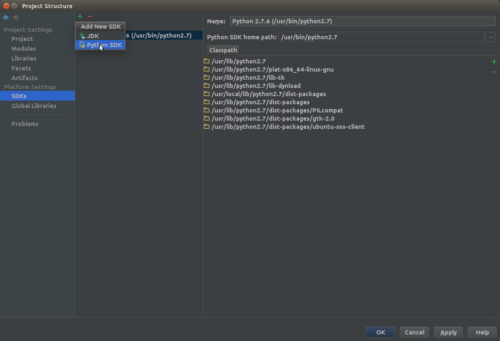
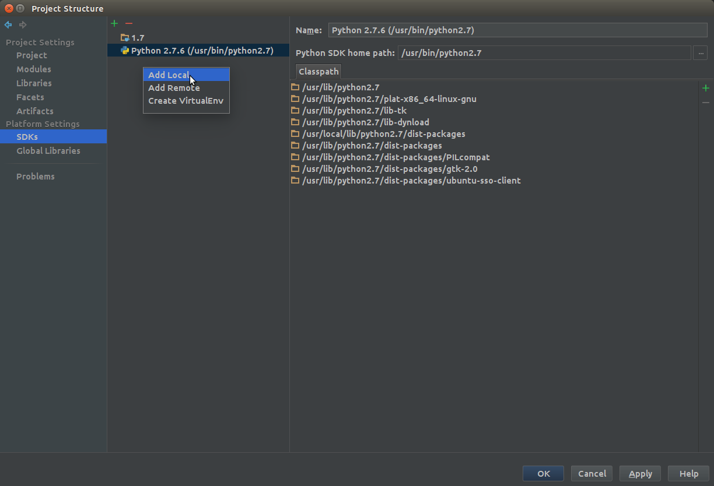
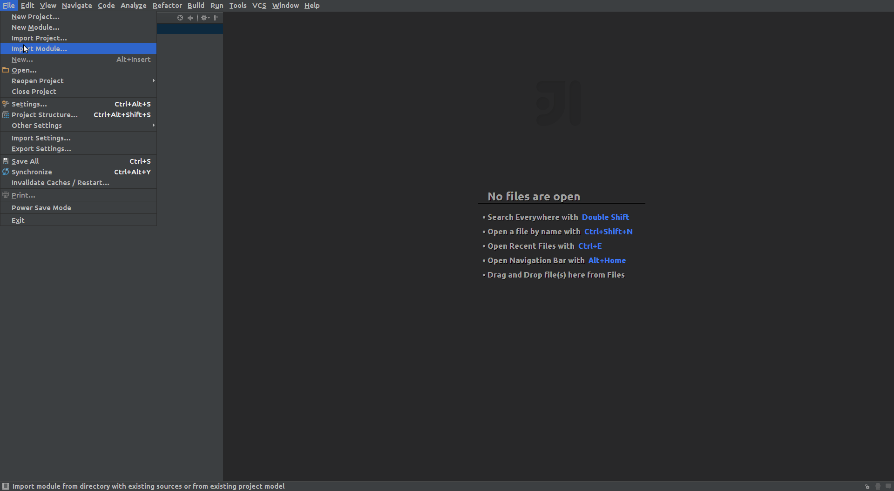
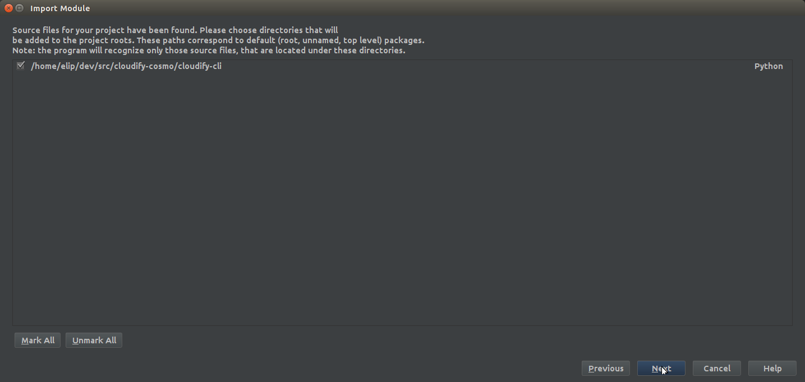
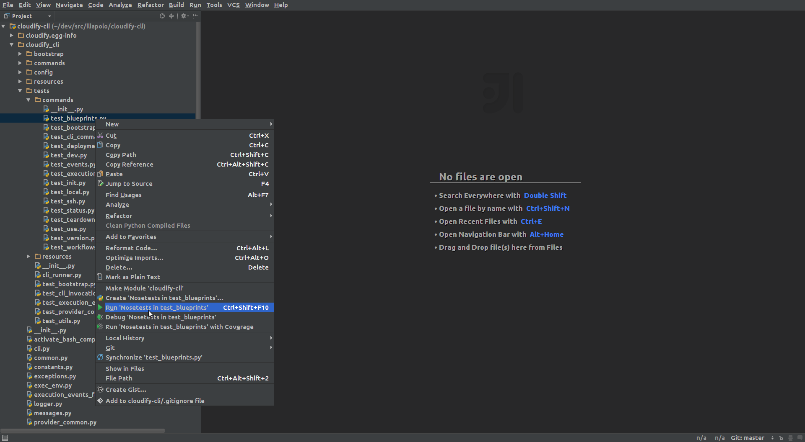

Setup and Maintain your environment: Step by Step Walk-through
==============================================================

# Setup

## Step 1: Installing pip

[pip](https://pip.pypa.io/en/latest/user_guide.html) is a python package that allows you to easily install other python packages.
We recommend reading a bit about this tool and understanding its features. Installing it is easy:

```
~$ wget https://bootstrap.pypa.io/get-pip.py && sudo python get-pip.py
```

Verify its installed by running:

```
~$ pip --version
```

## Step 2: Installing virtualenv

[virtualenv](http://virtualenv.readthedocs.org/en/latest/virtualenv.html) is a python package that allows you to create isolated python environment.
Again, we recommend reading a bit about this tool and understanding its features. Installing it is easy:

```
~$ sudo pip install virtualenv
```

Verify its installed by running:

```
~$ virtualenv --version
```

## Step 3: Cloning cloudify repositories

Its a good idea to create a brand new directory for cloudify source code. In this tutorial we will use ```~/dev/src/cloudify-cosmo```

### SSH Authentication

We recommend [setting up an SSH Key with your Github account](https://help.github.com/articles/generating-ssh-keys/).
This will allow you to push code by using key-pair authentication, without the need to enter a username and password each time.
If you do not wish to do so, follow the instructions in the *Basic Authentication* part below.

Clone this repo:

```
~/dev/src/cloudify-cosmo$ git clone git@github.com:cloudify-cosmo/cloudify-dev.git
```

Since many repositories need to be cloned, we wrote a small python script to do that for you:

```
~/dev/src/cloudify-cosmo$ python cloudify-dev/scripts/clone_ssh.py
```

### Basic Authentication

This method of cloning will require you to authenticate with your Github credentials each time you push code.

Clone this repo:

```
~/dev/src/cloudify-cosmo$ git clone https://github.com/cloudify-cosmo/cloudify-dev
```

Since many repositories need to be cloned, we wrote a small python script to do that for you:

```
~/dev/src/cloudify-cosmo$ python cloudify-dev/scripts/clone_basic.py
```

## Step 4: Creating a virtualenv

Its also a good idea to have a dedicated directory for python virtual environments. In this tutorial we will use ```~/dev/venvs```
Once you have this directory in place, lets create a new virtualenv for all cloudify related stuff:

```
~/dev/venvs$ virtualenv cloudify-cosmo
```

now lets activate this env:

```
~/dev/venvs$ source cloudify-cosmo/bin/activate
```

from this point on (until you deactivate the virtualenv or exist the shell),
all python packages will by installed under this virtualenv, i.e, inside ```~/dev/venvs/cloudify-cosmo/lib/python2.7/site-packages```

## Step 5: Installing cloudify sources

Now we need to install all the cloudify packages to the virtualenv. Usually to install packages we can just run, for example:

```
~/dev/src/cloudify-cosmo$ pip install cloudify-dsl-parser/
```

This will copy the necessary source files to the virtualenv, which will make them available when you run python from this virtualenv.
However, this means that any time you change code, you will have to re-install the package, since the new sources need to copied to the virtualenv.
When we are developing, this will become a hassle. Luckily, *pip* comes to our rescue. For development purposes, *pip* introduced a way to install packages in *editable* mode, by passing the *-e* flag:

```
~/dev/src/cloudify-cosmo$ pip install -e cloudify-dsl-parser/
```

What this does is create links between the virtualenv and your source files. Now when you run python, the interpreter will use the actual source files under the *cloudify-dsl-parser* folder.
So again, because we have many repositories, and packages need to be installed in a specific order, we wrote a small script to do that for you:

```
~/dev/src/cloudify-cosmo$ python cloudify-dev/scripts/install_packages.py
```

## Step 6: Verify your installation.

If you didn't encounter any errors during the previous steps, everything should be ok. However, lets double check.
To see a list of the installed cloudify packages, run this:

```
~/dev/src/cloudify-cosmo$ pip list | grep cloudify
```

the output (varies by version) should look like so:

```bash
~/dev/src/cloudify-cosmo$ pip list | grep cloudify
cloudify (3.2a1, /home/elip/dev/src/cloudify-cosmo/cloudify-cli)
cloudify-agent-installer-plugin (3.2a1)
cloudify-dsl-parser (3.2a1, /home/elip/dev/src/cloudify-cosmo/cloudify-dsl-parser)
cloudify-plugin-installer-plugin (3.2a1)
cloudify-plugins-common (3.2a1, /home/elip/dev/src/cloudify-cosmo/cloudify-plugins-common)
cloudify-rest-client (3.2a1, /home/elip/dev/src/cloudify-cosmo/cloudify-rest-client)
cloudify-rest-service (3.2a1)
cloudify-riemann-controller-plugin (3.2a1)
cloudify-script-plugin (1.2a1, /home/elip/dev/src/cloudify-cosmo/cloudify-script-plugin)
cloudify-workflows (3.2a1)
```

## Step 7: Installing nose, testtools, and mock

These packages are only test dependencies and are therefore not installed during the installation phase.
That's ok, its just three packages, lets install them manually.
Like we mentioned, *nose* is the framework we use to run our tests:

```
~/dev/src/cloudify-cosmo$ pip install nose
```

*mock* is a python mocking framework we also use:

```
~/dev/src/cloudify-cosmo$ pip install mock
```

And *testtools* is the base testing framework we use. It does not come packed with python:

```
~/dev/src/cloudify-cosmo$ pip install testtools
```

## Step 8: Running unit tests

Lets verify we are able to run unit tests. Just as a sanity check, lets run the *cloudify-dsl-parser* tests:

```bash
~/dev/src/cloudify-cosmo$ nosetests cloudify-dsl-parser/dsl_parser/tests/
......................................................................
----------------------------------------------------------------------
Ran 430 tests in 12.618s
OK
```

## Step 9: Running integration tests

A fully functional environment is one that has everything setup in order to run the integration tests locally.
To do so, follow the instructions [Here](https://github.com/cloudify-cosmo/cloudify-manager/tree/master/tests)

## Step 10 (optional): IDE setup

This section only refers to [Intellij IDE](https://www.jetbrains.com/idea/), which is the recommended IDE in our opinion. <br>
The first thing you need to do is install the [Intellij Python Plugin](https://plugins.jetbrains.com/plugin/?idea&pluginId=631), you can install it directly from Intellij. <br>

- Create a new empty project and give it a name (maybe cloudify-cosmo?)


- Setup your project you work with the virtualenv we created

Go to File --> Project Structure. On the left hand pane, click **SDKs** under the **Platform Settings** section.<br>
Now add the virtualenv as an additional Python SDK, as seen in the images: <br><br>
 <br><br>
 <br><br>
 <br><br>

Once you apply and the process is finished, you should see your new SDK on the list. Now lets make this SDK the default project SDK: <br>
Go to File --> Project Structure. On the left hand pane, click **Project** under the **Project Settings** section.<br>


Apply the changes. <br><br>
Next up is to import the code. In intellij, each source code project is called a **module**, and a collection of *modules** is called a project (Yeah, go figure...).
So what we want to do is to import all our **modules**. For example, lets import the *cloudify-cli* module: <br>

 <br><br>
 <br><br>
 <br><br>
 <br><br>
 <br><br>

Repeat the exact same process for every module.

Your Intellij project should now look like this: <br>


We want to be able to run tests directly from intellij, and not having to execute a command line. To do so properly, we need to configure the default test runner intellij will use.
Like we mentioned (twice), we use *nose* to run tests, intellij actually has built-in support for it, we just have to tell it that's what we want.
The annoying part though, is that we have to do it for every **module** separately. For example, lets to this for the *cloudify-cli* **module**. <br>

Go to File --> Settings and search for *Python Integrated Tools*.


Do this for all modules and apply the change. <br>
Now lets make sure this worked, to do that we will try to run some unit tests from the *cloudify-cli* **module**. <br>
Traverse that **module** as following: cloudify-cli-->cloudify_cli-->tests-->commands, now right click the *test_blueprints.py* file.
Notice it should should give you the option to run tests in this file using *Nosetests*

If you don't see the option to run the test using *Nosetests*, try restarting IntelliJ.



The execution will be very quick, if you see something like this, your done! :)


# Maintain

Cloudify code changes pretty rapidly, we suggest you sync your code (git pull) at least once a day.
Remember that when you work on a feature/bug, you should always be working on your own branch, leaving the *master* branch clean of changes or commits.
So, by syncing we mean updating the *master* branch of every project.
If you follow this, syncing your master branch should not introduce any conflicts, and it just a matter of running:

```
(cloudify-cosmo)10:14:43 (master) ~/dev/src/cloudify-cosmo/cloudify-cli$ git pull origin master
```

On every directory. Its up to you when you wish to update your own branch with the latest changes from *master*, to do so run the following (after you've synced the master branch):

```bash
(cloudify-cosmo)10:14:43 (master) ~/dev/src/cloudify-cosmo/cloudify-cli$ git checkout <branch_name>
(cloudify-cosmo)10:14:43 (<branch_name>) ~/dev/src/cloudify-cosmo/cloudify-cli$ git merge master
```

### One important note

Every time a new version is released, the version number of each project is progressed accordingly.
However, just updating the source code does not inform *pip* that the version has changed, and as far as dependencies go, you still have the *old* version installed.
This can cause conflicts with dependency resolution and should be avoided.
So we need to force *pip* to recognize a version change, essentially it means re-installing the packages.

```
~/dev/src/cloudify-cosmo$ python cloudify-dev/scripts/install_packages.py
```

Also, its a good idea to stay tuned to the [cloudify-developers](https://groups.google.com/forum/#!forum/cloudify-developers) group, as changes are posted there.
